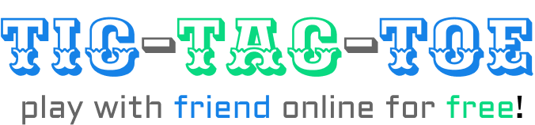

	
	

TicTacToe is a simple, yet fun, game of Tic-Tac-Toe. 

Frontend wrote in Vue.js with some plugins like router or toastification. Backend is written in fastAPI with some plugins like swagger.
> 🚀 Backend is available in repo called [api.hryszko.dev](https://github.com/Shirobachi/api.hryszko.dev/).

During writing this project I used learn a lot of new technologies and libraries. Some of them are: [fastAPI](https://fastapi.tiangolo.com/), [JWT](https://jwt.io/), [mongoDB](https://www.mongodb.com/), [GH action](https://github.com/features/actions), [docker](https://www.docker.com/), [vue.js](https://vuejs.org/), [router](https://router.vuejs.org/), [toastification](https://vue-toastification.maronato.dev/), [swagger](https://swagger.io/) and many others.

> BTW. you can play right now on [tictactoe.hryszko.dev](https://tictactoe.hryszko.dev/)

# Installation (frontend) 🏃
1. Clone the repo
2. Run npm install
3. Run npm run dev

# Contribution ✨
If you want to contribute, you are more than welcome to do so. You can create a pull request or open an issue. Don't forget use emoji to express your opinion 😁

# License 📝
This project is licensed under the [MIT](https://choosealicense.com/licenses/mit/) license.